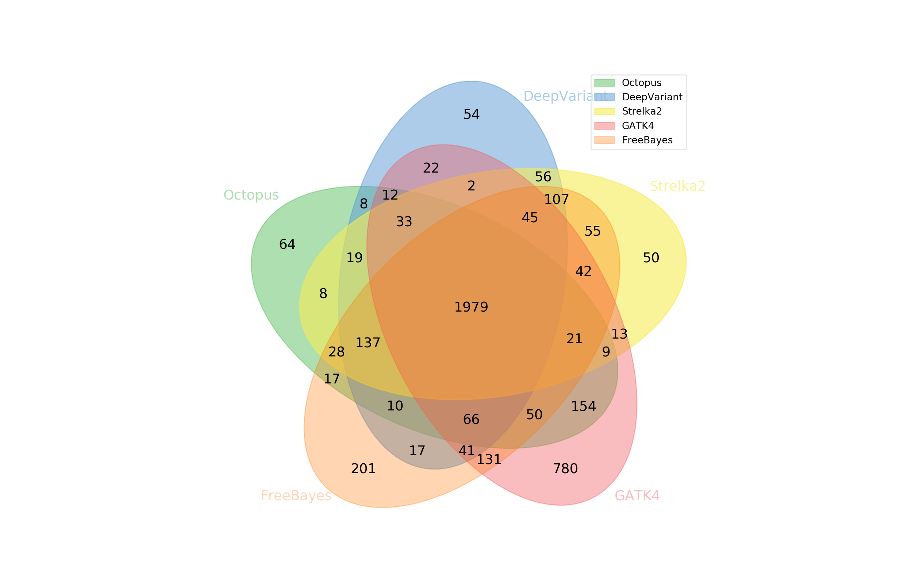

# Starfish

[](http://opensource.org/licenses/MIT)

Starfish is a tool for comparing and intersecting multiple VCF files with haplotype awareness by using the powerful [RTGTools](https://github.com/RealTimeGenomics/rtg-tools) `vcfeval` engine. The name "Starfish" comes from the shape of the Venn diagram the program can draw (with 5 VCFs!).



## Requirements

- Python3
- [pysam](https://github.com/pysam-developers/pysam)
- [bcftools](https://github.com/samtools/bcftools)
- [RTG Tools](https://github.com/RealTimeGenomics/rtg-tools)
- [pyvenn](https://github.com/tctianchi/pyvenn) [optional: for drawing Venn diagrams]

## Installation

```shell
git clone --recursive https://github.com/dancooke/starfish
```

## Usage

There are four required options:

- `--rtg`: The RTG Tools binary
- `--sdf`: The RTG Tools SDF reference directory (use `rtg format`)
- `--variants` (short `-V`): A list of VCF files to intersect.
- `--output` (short `-O`): A directory path to write intersections.

For example: 

```shell
./starfish \
    --rtg rtg \
    --sdf reference_sdf \
    -V vcf1.vcf.gz vcf2.vcf.gz vcf3.vcf.gz \
    -O isec
```

Will result in the directory `isec` containing the following files:

- `A.vcf.gz`: Records unique to `vcf1.vcf.gz`.
- `B.vcf.gz`: Records unique to `vcf2.vcf.gz`.
- `C.vcf.gz`: Records unique to `vcf3.vcf.gz`.
- `AB.vcf.gz`: Records in `vcf1.vcf.gz` and `vcf2.vcf.gz` but not `vcf3.vcf.gz`.
- `AC.vcf.gz`: Records in `vcf1.vcf.gz` and `vcf3.vcf.gz` but not `vcf2.vcf.gz`.
- `BC.vcf.gz`: Records in `vcf2.vcf.gz` and `vcf3.vcf.gz` but not `vcf1.vcf.gz`.
- `ABC.vcf.gz`: Records common to `vcf1.vcf.gz`, `vcf2.vcf.gz`, and `vcf3.vcf.gz`.

In other words, the VCF files are labelled (in order) using upper-case letters, and the filenames in the output directory contain records unique to the labels in the filename.

### Ignoring filtered records

By default, records that are filtered are not included in the comparison. To include them add the `--all_records` option the your command.

### Ignoring genotype mismatches

By default, records will not be matched if the genotypes do not match. 

## Drawing Venn diagrams

Starfish can draw Venn diagrams showing the number of intersected records for up to 6 VCFs (if the `pyvenn` package is installed). To do this you need to supply names for each of the VCFs with the `--names` command:

```shell
./starfish \
    --rtg rtg \
    --sdf reference_sdf \
    -V vcf1.vcf.gz vcf2.vcf.gz vcf3.vcf.gz \
    -O isec \
    --names Octopus GATK4 FreeBayes
```

To save the Venn diagram to PDF use the `--vennout` option.

## Limiations

Since RTG Tools vcfeval is used to compare VCF files, starfish inherits all limitations of this tool. Namely:

- Only one sample can be compared. You can use the `--sample` option if your VCFs have multiple samples, but the given sample must be present in all input VCFs.